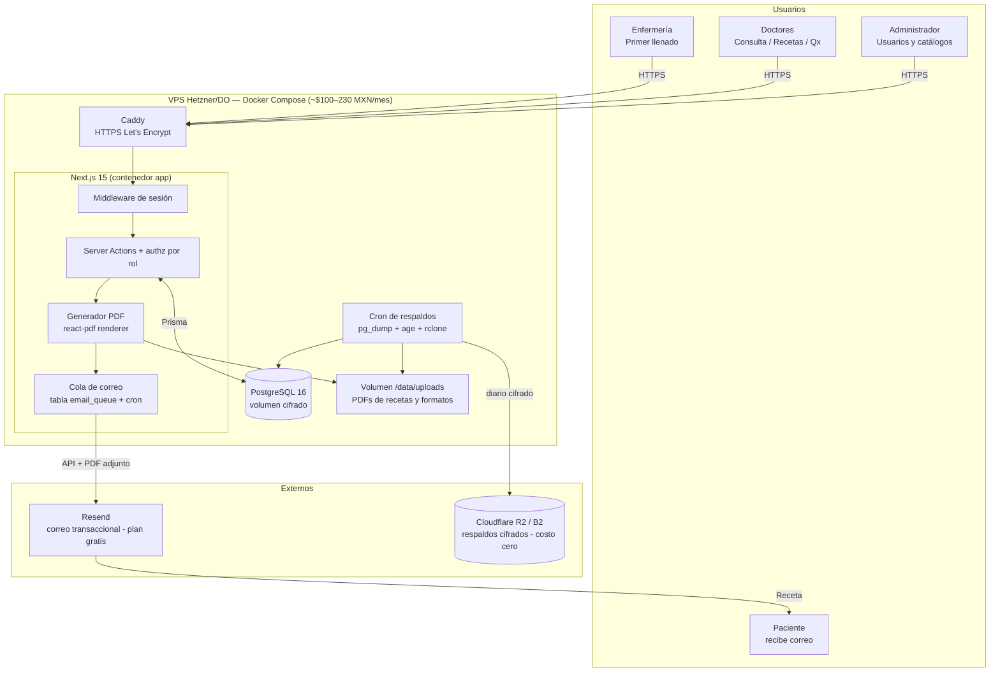
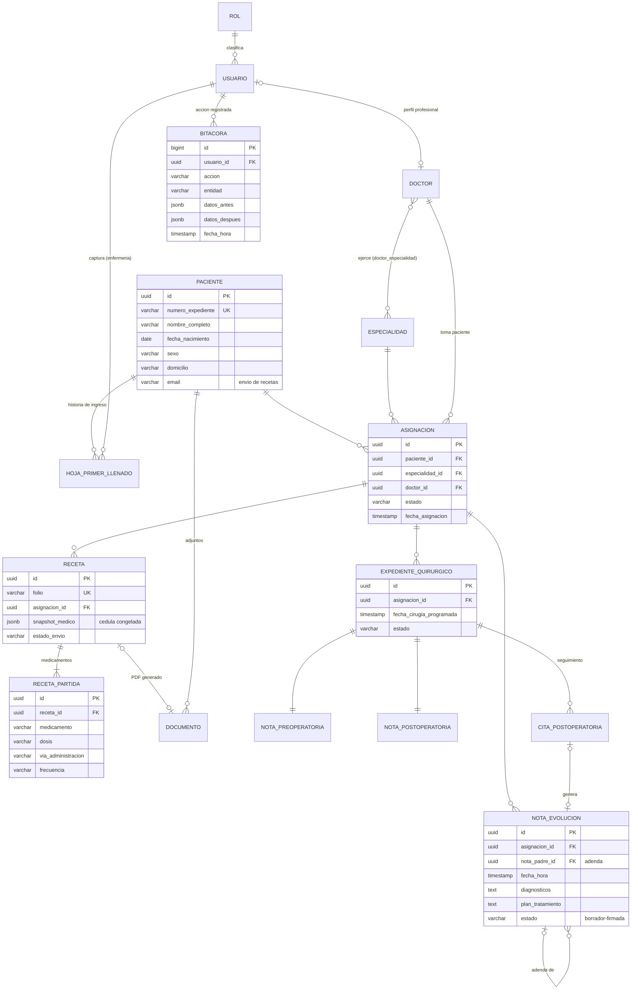
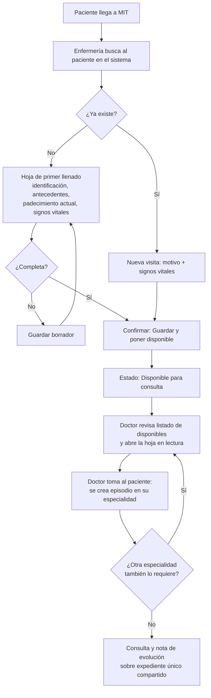
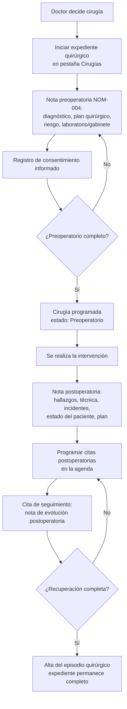
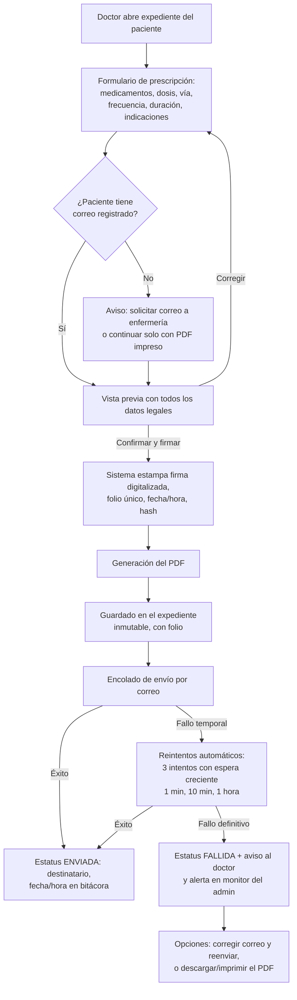

# PLAN_SISTEMA.md — Plan Técnico del Sistema CRM / Expediente Clínico Electrónico Medical Tower

| | |
|---|---|
| **Proyecto** | Sistema CRM médico / Expediente Clínico Electrónico |
| **Cliente** | MIT — Medical Tower |
| **Preparado por** | MAW Soluciones |
| **Fecha** | Julio 2026 |
| **Referencia comercial** | Cotización aceptada: $20,000 MXN desarrollo + $4,500 MXN/mes operación |
| **Marco normativo** | NOM-004-SSA3-2012, LGS art. 28 bis y 226, Reglamento de Insumos para la Salud arts. 28–31, LFPDPPP |

---

## 1. Resumen ejecutivo

MIT — Medical Tower es un edificio médico con múltiples especialidades (traumatología, neurología, cardiología, cirugía estética, entre otras) al que la autoridad sanitaria exige llevar expediente clínico conforme a la NOM-004-SSA3-2012. Este documento define el plan técnico completo del sistema web que cubrirá esa exigencia dentro del presupuesto cotizado.

**Qué hará el sistema.** Un CRM médico web en español con tres roles: **Enfermería** realiza el "primer llenado" (hoja de ingreso con ficha de identificación, antecedentes e historia clínica — puerta de entrada de todo paciente); los **Doctores** ven el listado de pacientes capturados, los toman a su consulta, redactan notas de evolución, emiten **recetas digitales en PDF que se envían automáticamente al correo del paciente**, llenan el **expediente quirúrgico** (notas pre y postoperatoria alineadas campo por campo a la NOM-004) y dan seguimiento con **citas postoperatorias**; el **Administrador** gestiona doctores, especialidades, usuarios y supervisa la bitácora. Un paciente puede estar en varias especialidades a la vez, cada una con sus propias notas, sobre un **expediente único compartido** entre los médicos que lo atienden.

**Cómo se construirá.** Aplicación full-stack con Next.js 15 + TypeScript + PostgreSQL 16 + Prisma, desplegada con Docker Compose en un VPS. PDFs con `@react-pdf/renderer`; correo transaccional con Resend (plan gratuito suficiente para el volumen esperado); respaldos diarios cifrados fuera del servidor (Cloudflare R2, nivel gratuito). Costo de infraestructura estimado: **$120–$280 MXN/mes**, muy por debajo del techo operativo, dejando más del 90 % de la mensualidad de $4,500 MXN para soporte, mantenimiento y utilidad.

**Cumplimiento.** El modelo de datos transcribe los campos mínimos de la NOM-004 (historia clínica 6.1, nota de evolución 6.2, notas preoperatoria 8.5 y postoperatoria 8.8); toda nota clínica es **inmutable una vez firmada** (correcciones por adenda, cancelaciones con motivo, jamás borrado físico), con bitácora de auditoría append-only y retención mínima de 5 años. La receta cumple el Reglamento de Insumos para la Salud (cédula profesional, institución del título, domicilio del establecimiento, denominación genérica, dosis, vía, frecuencia y duración) con **firma digitalizada + sello del sistema** (postura adoptada; la e.firma/FIEL queda fuera de presupuesto). Los **medicamentos controlados (fracciones I–III) quedan explícitamente fuera del alcance**.

**Plan.** Cinco fases (las cotizadas): F1 análisis/diseño (1 semana), F2 módulos base (2 semanas), F3 expediente y recetas (2 semanas), F4 quirúrgico y postoperatorio (2 semanas), F5 pruebas/capacitación/entrega (1 semana). **Total: 8 semanas.** La Fase 1 cierra con un acta de alcance que resuelve las 12 decisiones abiertas listadas en la sección 7 (firma, controlados, oficio de la autoridad, aviso de privacidad, entre otras).

---

## 2. Arquitectura y stack

### 2.1 Stack recomendado

| Capa | Tecnología | Versión |
|---|---|---|
| Framework full-stack | **Next.js** (App Router, Server Components + Server Actions) | 15.x |
| Lenguaje | **TypeScript** | 5.x |
| Base de datos | **PostgreSQL** | 16.x |
| ORM | **Prisma** (migraciones versionadas) | 6.x |
| Autenticación | **Auth.js (NextAuth v5)**, proveedor Credentials + sesiones en BD | 5.x |
| UI | **Tailwind CSS + shadcn/ui** | — |
| Validación | **Zod** (esquemas compartidos formulario/servidor) | — |
| PDF | **@react-pdf/renderer** (server-side) | — |
| Correo | **Resend** (SDK oficial) | — |
| Jobs ligeros | cron del sistema + cola en BD (tabla `email_queue`) | — |
| Contenedores | **Docker Compose** (app + Postgres + Caddy) | — |

**Justificación.** El proyecto es un CRUD médico de formularios largos: Server Components y Server Actions eliminan la API separada (~30–40 % menos código, clave para el presupuesto de $20,000 MXN) y concentran todo el control de acceso en el servidor. PostgreSQL es la elección natural para datos relacionales (paciente ↔ especialidades N:M, notas, recetas, cirugías) y aporta `jsonb` para secciones flexibles. Prisma da migraciones versionadas y tipado end-to-end. Auth.js con Credentials basta porque los usuarios los crea el Administrador (no hay auto-registro).

**Alternativas descartadas.** *Laravel + MySQL*: válido y barato, pero el equipo trabaja en TypeScript (un solo lenguaje = menos horas), las plantillas PDF como componentes React son más mantenibles, y el tipado Zod+Prisma reduce errores en formularios clínicos. *Supabase (BaaS)*: la lógica "el doctor solo ve sus pacientes pero el expediente es compartido" es más segura implementada en servidor propio que en políticas RLS complejas, y el plan gratuito pausa proyectos inactivos (inaceptable en un sistema médico).

### 2.2 Hosting

| Opción | Costo estimado | Pros | Contras |
|---|---|---|---|
| **A. VPS Hetzner (región Ashburn, EE. UU.; CX/CPX 2 vCPU, 4 GB)** — recomendada | ~$95–$130 MXN/mes | Costo mínimo, control total del dato clínico, Postgres local | Administración propia (mitigada con Docker + respaldos automáticos) |
| B. DigitalOcean Droplet 2 GB | ~$230 MXN/mes | Proveedor con facturación convencional, baja latencia | ~2.4× el costo por menos recursos |
| C. Vercel Pro + Neon (serverless) | > $400 MXN/mes | Cero administración | Rebasa el objetivo; el plan gratuito prohíbe uso comercial; cron/colas y PDF chocan con límites serverless; dato clínico en dos proveedores |

**Postura adoptada: opción A (Hetzner Ashburn) con Docker Compose; DigitalOcean como plan B si el cliente prefiere ese proveedor.** Caddy como reverse proxy (HTTPS automático Let's Encrypt, HSTS; solo Caddy expone puertos). Dominio propio (~$21 MXN/mes prorrateado).

### 2.3 Correo transaccional (recetas)

**Postura adoptada: Resend** (la sección normativa admitía "SES, Resend o similar"; se fija Resend por su SDK, adjuntos PDF nativos y verificación SPF/DKIM/DMARC en minutos). Plan gratuito: 3,000 correos/mes — un edificio de ~20 consultorios difícilmente supera 1,500 recetas/mes. Ruta de escalamiento: Amazon SES ($0.10 USD/1,000), cambiando una sola función (`lib/email.ts`). El envío es **asíncrono**: al firmar la receta se encola en `email_queue` y un cron la procesa con reintentos; un fallo del proveedor de correo nunca bloquea la consulta.

### 2.4 Generación de PDF

`@react-pdf/renderer` en el servidor: plantillas (receta, hoja de ingreso, notas quirúrgicas) como componentes React fáciles de ajustar; sin navegador headless (Puppeteer consumiría ~300 MB de RAM por instancia). El PDF se guarda en `/data/uploads` (respaldado) y su registro (folio, ruta, `hash_sha256`) queda en la tabla `documento`. Descartados: `pdf-lib` (muy bajo nivel) y Puppeteer (costo de RAM innecesario).

### 2.5 Respaldos (estrategia 3-2-1 simplificada)

1. `pg_dump` diario (cron 2:00 AM), formato custom comprimido, retención local 7 días.
2. Copia **cifrada con `age`** subida con `rclone` a **Cloudflare R2** (10 GB gratis, sin egreso) o Backblaze B2. Retención remota: 30 diarios + 12 mensuales; una BD de este tamaño cabe en el nivel gratuito → costo $0. Retención total de respaldos alineada a los **5 años** de la NOM-004.
3. `rclone sync` diario de `/data/uploads` (PDFs).
4. Implementación: script versionado `ops/backup.sh` (o contenedor `prodrigestivill/postgres-backup-local`).
5. **Prueba de restauración mensual** documentada en el runbook de entrega (F5): un respaldo que nunca se restauró no es un respaldo.

### 2.6 Seguridad

- **HTTPS obligatorio** (Caddy + Let's Encrypt, HSTS); la app no expone puertos públicos.
- **Contraseñas: Argon2id** (`@node-rs/argon2`, parámetros OWASP), política de contraseñas y bloqueo temporal tras 5 intentos fallidos.
- **Autorización EN EL SERVIDOR**: el middleware solo filtra rutas de forma gruesa; la autorización real vive en una capa única (`lib/authz.ts`) invocada por **cada** Server Action: sesión + rol + **propiedad del recurso** (Doctor solo lee/escribe expedientes de pacientes con asignación activa suya; Enfermería solo primer llenado; Admin catálogos y supervisión). El filtro Prisma `where: { asignaciones: { some: { doctorId } } }` sale de un repositorio central, no se repite a mano.
- **Cifrado en reposo**: volumen del VPS cifrado (LUKS) + respaldos siempre cifrados antes de salir del servidor. **Postura adoptada sobre cifrado por columna**: solo para campos de altísima sensibilidad si el cliente los captura (AES-256-GCM, clave en variable de entorno); no se cifra columna por columna todo el expediente (impediría búsquedas, complica respaldos y no mitiga el vector principal). La combinación disco cifrado + respaldos cifrados + control por rol + bitácora es proporcional al riesgo y consistente con la LFPDPPP.
- **Sesiones en base de datos** (no JWT): cookie `HttpOnly`/`Secure`/`SameSite=Lax`, expiración de 8 h con renovación por actividad, revocables por el Administrador al dar de baja a un usuario. Cierre por inactividad de 15 min (configurable) en cliente. Recomendado 2FA para el rol Administrador (decisión abierta §7).
- **Bitácora de auditoría** append-only (ver §3.8) e **inmutabilidad de notas firmadas** reforzada con trigger en BD, no solo validación de aplicación.
- Ambiente de producción separado; sin datos reales en desarrollo/pruebas.

### 2.7 Diagrama de arquitectura



### 2.8 Estructura de carpetas propuesta

```
medtower-crm/
├── docker-compose.yml          # app + postgres + caddy
├── Caddyfile
├── .env.example                # DATABASE_URL, RESEND_API_KEY, AUTH_SECRET, ENCRYPTION_KEY
├── ops/
│   ├── backup.sh               # pg_dump + age + rclone → R2
│   └── restore.md              # runbook de restauración (probado en F5)
├── prisma/
│   ├── schema.prisma           # entidades de la sección 3
│   ├── migrations/
│   └── seed.ts                 # admin inicial + catálogos
├── src/
│   ├── app/
│   │   ├── (auth)/login/
│   │   ├── (protected)/
│   │   │   ├── admin/          # usuarios, doctores, especialidades (solo ADMIN)
│   │   │   ├── enfermeria/     # primer llenado / hoja de ingreso
│   │   │   ├── pacientes/[id]/ # expediente, recetas, cirugia, citas
│   │   │   └── mi-consulta/    # pacientes asignados al doctor en sesión
│   │   └── api/cron/           # procesar email_queue
│   ├── actions/                # Server Actions por dominio
│   ├── lib/                    # auth.ts, authz.ts, db.ts, email.ts, crypto.ts, audit.ts
│   ├── pdf/                    # Receta.tsx, HojaIngreso.tsx, NotaPreoperatoria.tsx, NotaPostoperatoria.tsx
│   ├── schemas/                # Zod compartido
│   └── components/
└── tests/                      # autorización por rol y flujos críticos (F5)
```

### 2.9 Costos mensuales de operación (infraestructura)

| Concepto | Costo |
|---|---|
| VPS (Hetzner Ashburn o DO 2 GB) | $95–$230 MXN |
| Dominio (prorrateado) | ~$21 MXN |
| Resend (≤3,000 correos/mes) | $0 |
| Respaldos R2/B2 (≤10 GB) | $0 |
| **Total** | **~$120–$280 MXN/mes** |

Margen sobre la mensualidad de $4,500 MXN: **> 90 %** destinable a soporte, mantenimiento y utilidad, con ruta de escalamiento (VPS mayor, SES, R2 de pago) sin cambiar la arquitectura.

---

## 3. Modelo de datos

Modelo lógico (tipos SQL genéricos). Salvo indicación contraria, toda tabla incluye `id UUID PK`, `created_at TIMESTAMP`, `created_by FK→usuario`. Las tablas clínicas son **append-only** (ver §3.9). Nomenclatura canónica del proyecto: los nombres de tabla de esta sección (`bitacora`, no `audit_log`; en Prisma se mapean con `@@map`).

### 3.1 Seguridad y catálogos

**rol** — `clave VARCHAR(20) UNIQUE` (`ADMIN`, `DOCTOR`, `ENFERMERIA`), `nombre`, `permisos JSONB` (granularidad fina, futuro).

**usuario** — `rol_id FK` (1 rol por usuario, suficiente para el alcance), `email UNIQUE` (login), `password_hash` (Argon2id, nunca en claro), `nombre_completo`, `activo BOOLEAN` (baja lógica, jamás DELETE físico), `ultimo_acceso`.

**especialidad** (lo administra el Admin) — `nombre UNIQUE` (Traumatología, Neurología, Cardiología, Cirugía Estética…), `descripcion`, `activa`.

**doctor** (perfil profesional, separado de `usuario` porque los datos de cédula son exigencia normativa, no de autenticación):

| Campo | Notas |
|---|---|
| usuario_id FK UNIQUE | 1:1 con su cuenta |
| cedula_profesional VARCHAR(20) | **obligatorio NOM-004; sin cédula el sistema no permite emitir recetas** |
| cedula_especialidad VARCHAR(20) NULL | si aplica |
| institucion_titulo VARCHAR(150) | obligatorio en receta (RIS) |
| universidad_especialidad NULL, consultorio, telefono | |
| firma_digitalizada TEXT/BLOB NULL | imagen de rúbrica para la receta |

**doctor_especialidad** — N-M, PK compuesta `(doctor_id, especialidad_id)`: un doctor puede ejercer varias especialidades.

### 3.2 Paciente y primer llenado (Enfermería)

**paciente** — núcleo del expediente único:

| Campo | Notas |
|---|---|
| numero_expediente VARCHAR(20) UNIQUE | folio legible, ej. `MIT-2026-00341` |
| nombre, apellido_paterno, apellido_materno | |
| fecha_nacimiento DATE | la edad se calcula, no se almacena |
| sexo, curp NULL, tipo_sangre NULL | catálogos controlados |
| domicilio (calle, colonia, municipio, estado, cp) | ficha de identificación NOM-004 |
| telefono, **email** | email = **destino del envío automático de recetas**; obligatorio en captura salvo casilla explícita "sin correo" (postura adoptada, ver §4.4-A) |
| contacto_emergencia (nombre/teléfono/parentesco) | |
| activo BOOLEAN | |

**hoja_primer_llenado** (historia clínica de ingreso; la captura Enfermería; 1 vigente por paciente, versionable):

| Campo | Notas |
|---|---|
| paciente_id FK, version INT | corrección = nueva versión, no se edita |
| motivo_consulta, padecimiento_actual | NOM-004 |
| antecedentes_heredofamiliares | NOM-004 |
| antecedentes_personales_patologicos | incluye tabaquismo, alcoholismo, toxicomanías |
| antecedentes_personales_no_patologicos | |
| antecedentes_gineco_obstetricos NULL | cuando aplique |
| **alergias** | crítico para prescripción; se destaca en rojo en todo el expediente |
| medicamentos_actuales | |
| signos vitales: ta_sistolica/ta_diastolica, fc, fr (INT), temperatura NUMERIC(4,1), peso_kg, talla_cm, spo2 | exploración física NOM-004; IMC calculado |
| observaciones_enfermeria | |
| capturado_por FK→usuario, fecha_hora_captura | fecha y hora obligatorias en toda nota (NOM-004) |
| estado | `borrador` → `cerrada` (al cerrar es inmutable) |

### 3.3 Asignación paciente–especialidad–doctor

**asignacion** — corazón del flujo "los doctores toman pacientes": `paciente_id FK`, `especialidad_id FK`, `doctor_id FK`, `fecha_asignacion`, `motivo NULL`, `estado` (`activa`, `alta`, `referida`, `cancelada`), `fecha_cierre NULL`. Índice UNIQUE parcial sobre `(paciente_id, especialidad_id, doctor_id)` con `estado='activa'` para no duplicar la misma atención activa.

**Por qué N–M con tabla propia.** El requerimiento 3 exige que un paciente esté simultáneamente en varias especialidades. Un FK `especialidad_id` en `paciente` lo impediría y "moverlo" destruiría el historial. La tabla `asignacion` resuelve tres cosas:

1. **Multiplicidad real**: N pacientes × M especialidades, cada combinación con su ciclo de vida (`activa`/`alta`) y sus notas, sin duplicar al paciente (**expediente único**: `paciente` existe una sola vez y todos los doctores asignados ven el mismo expediente).
2. **Atribución clínica y legal**: cada nota, receta y cirugía queda atribuida a un médico responsable dentro de una especialidad (exigencia NOM-004) y de ahí se deriva el control de acceso: "Doctor solo ve sus pacientes" = pacientes con asignación activa suya, viendo el expediente completo (incluidas notas de otras especialidades tratantes).
3. **Historial**: es una relación con atributos (fecha, motivo, estado), imposible sin tabla propia.

### 3.4 Notas de evolución

**nota_evolucion** (cuelga de una asignación → hereda especialidad y doctor; visible para todos los doctores con asignación activa del paciente): `asignacion_id FK`, `fecha_hora` (NOM-004), `evolucion_actualizacion`, `signos_vitales JSONB NULL`, `resultados_estudios NULL`, `diagnosticos` (FK a catálogo CIE-10 en fase futura), `pronostico`, `plan_tratamiento` (vía, dosis, periodicidad — NOM-004 6.2), `elaborada_por FK→usuario`, `estado` (`borrador` → `firmada`, inmutable al firmar), `nota_padre_id FK NULL` (**adenda**: las correcciones se agregan como nota hija; jamás se edita la original).

### 3.5 Recetas (maestro–detalle)

**receta**: `folio VARCHAR(20) UNIQUE` (consecutivo, ej. `RX-2026-000123`), `asignacion_id FK` (liga paciente + doctor + especialidad), `nota_evolucion_id FK NULL`, `fecha_emision`, `diagnostico`, `indicaciones_generales NULL`, **`snapshot_medico JSONB`** (copia congelada de nombre, cédula, institución y domicilio del emisor al momento de emitir — el documento legal no debe mutar si el doctor actualiza su perfil), `snapshot_paciente JSONB`, `documento_id FK NULL` (PDF), `estado_envio` (`pendiente`, `enviada`, `error`), `fecha_envio_email NULL`, `estado` (`emitida`, `cancelada` — cancelar no borra: queda con motivo).

**receta_partida** (renglones): `receta_id FK`, `orden`, `medicamento` (denominación genérica + distintiva opcional), `presentacion`, `dosis`, `via_administracion`, `frecuencia`, `duracion`, `cantidad`, `indicaciones NULL`. *(Opcional F3+: catálogo `medicamento` para autocompletar; las partidas guardan texto plano de todos modos para congelar el documento.)*

### 3.6 Expediente quirúrgico (NOM-004, numerales 8.5 y 8.8)

**expediente_quirurgico**: `asignacion_id FK` (cirujano responsable + especialidad), `paciente_id FK` (redundancia controlada para consulta directa), `fecha_cirugia_programada`, `quirofano_sede`, `estado` (`preoperatorio`, `realizada`, `cancelada`).

**nota_preoperatoria** (1:1; campos = NOM-004 8.5): `fecha_hora`, `diagnostico_preoperatorio`, `plan_quirurgico`, `tipo_cirugia` (programada/urgencia), `riesgo_quirurgico` (con justificación: ASA, etc.), `cuidados_y_plan_terapeutico`, `pronostico`, `elaborada_por`, `estado` (`borrador`/`firmada`).

**nota_postoperatoria** (1:1; campos = NOM-004 8.8): `fecha_hora`, `diagnostico_preoperatorio`, `operacion_planeada`, `operacion_realizada`, `diagnostico_postoperatorio`, `descripcion_tecnica_quirurgica`, `hallazgos_transoperatorios`, `reporte_conteo_gasas_compresas_instrumental`, `incidentes_accidentes`, `cuantificacion_sangrado`, `transfusiones NULL`, `estudios_transoperatorios NULL`, `ayudantes_anestesiologo_enfermeria` (equipo quirúrgico), `estado_postquirurgico_inmediato`, `plan_manejo_tratamiento`, `pronostico`, `envio_piezas_patologia NULL`, `elaborada_por`, `estado`.

**Consentimiento informado** (postura adoptada, ver §7-6): en F4 se maneja como **documento adjunto escaneado** (`documento` con tipo `CONSENTIMIENTO`), con registro de fecha de recabado en el preoperatorio; la generación de formatos de consentimiento es alcance adicional.

### 3.7 Citas postoperatorias

**cita_postoperatoria**: `expediente_quirurgico_id FK`, `asignacion_id FK` (doctor que da seguimiento), `fecha_hora_programada`, `motivo` (retiro de puntos, valoración…), `estado` (`programada`, `realizada`, `no_asistio`, `reprogramada`, `cancelada`), `nota_evolucion_id FK NULL` (nota generada al atender la cita), `observaciones NULL`.

### 3.8 Documentos, cola de correo y bitácora

**documento** (PDFs generados o adjuntos): `paciente_id FK`, `tipo` (`RECETA`, `CONSENTIMIENTO`, `ESTUDIO`, `OTRO`), `nombre_archivo`, `ruta_o_clave_almacenamiento`, **`hash_sha256`** (integridad: demuestra que el archivo entregado al paciente es idéntico al conservado), `subido_por`, `fecha`.

**email_queue**: `receta_id FK`, `destinatario`, `intentos`, `proximo_intento`, `estado`, `ultimo_error` — soporte del envío asíncrono con reintentos (§5.2).

**bitacora** (append-only, sin UPDATE ni DELETE jamás): `id BIGSERIAL PK`, `usuario_id FK`, `rol_snapshot`, `accion` (`CREAR`, `FIRMAR`, `ADENDAR`, `CANCELAR`, `LOGIN`, `LOGIN_FALLIDO`, `CONSULTAR_EXPEDIENTE`, `ENVIAR_RECETA`…), `entidad`, `entidad_id`, `paciente_id NULL` (índice para responder "¿quién tocó este expediente?"), `datos_antes`/`datos_despues JSONB`, `ip_origen`, `fecha_hora` (reloj del servidor, no del cliente).

### 3.9 Estrategia de auditoría e inmutabilidad

1. **Las notas clínicas nunca se editan ni se borran; se adicionan.** Ciclo `borrador → firmada/cerrada`; en borrador el autor corrige, al firmar el registro queda de solo lectura **a nivel de aplicación y de base de datos** (trigger que rechaza UPDATE/DELETE sobre firmados). Corrección posterior = **adenda** (`nota_padre_id`) con su propia fecha, hora y autor; la vista del expediente muestra original + adendas encadenadas. La hoja de primer llenado corrige por **versionado**. Recetas y notas erróneas se **cancelan** con motivo obligatorio, jamás se eliminan — coherente con la retención de 5 años.
2. **Quién, qué, cuándo — doble mecanismo**: en la fila (`created_by`/`elaborada_por` + timestamp del servidor; no hay `updated_by` en tablas clínicas porque no hay updates; los catálogos sí llevan `updated_at`/`updated_by`) y en la `bitacora`, incluyendo **lecturas de expediente**, accesos y fallos de login, y el evento `ENVIAR_RECETA` con resultado del correo (evidencia de la entrega automática).
3. **Integridad de documentos** vía `hash_sha256`.
4. **Atribución estructural vía `asignacion`**: trazabilidad y control de acceso se derivan del mismo dato.
5. **Bajas lógicas universales**: ningún DELETE físico en el sistema.

### 3.10 Diagrama entidad-relación



---

## 4. Flujos por rol y pantallas

Todo el sistema opera 100 % en español (interfaz, errores, correos, documentos).

### 4.1 Enfermería (primer llenado)

1. Login (correo + contraseña) → **dashboard de enfermería**: contador de registros de hoy, botón prominente "Registrar nuevo paciente", borradores pendientes.
2. Antes de registrar, **busca al paciente** (nombre, CURP, teléfono) para evitar duplicados. Si existe → **nueva visita**: solo motivo del día + signos vitales (no recaptura historia). Si no → "Registrar nuevo paciente".
3. Llena la **hoja de primer llenado** (§4.4) por secciones, con **borrador** guardable en cualquier momento y autoguardado.
4. Al terminar: "Guardar y poner disponible" (confirmación) → el paciente queda **"Disponible para consulta"** para los doctores. Opcionalmente marca especialidad(es) sugerida(s) (ayuda a filtrar, no asigna).
5. Cierra sesión al terminar el turno (cierre automático por inactividad como respaldo).

**No puede**: ver notas médicas, recetas ni expedientes quirúrgicos; editar hojas ya tomadas por un doctor (solo lectura + nueva toma de signos vitales).

### 4.2 Doctor

1. Login → **dashboard**: "Mis pacientes de hoy", citas postoperatorias del día, contador de **pacientes disponibles**.
2. En "Pacientes disponibles" filtra (fecha, especialidad sugerida, texto), abre la hoja de primer llenado en lectura y presiona **"Tomar paciente"** → se crea la **asignación** (episodio de atención en su especialidad) sobre el **expediente único**. Otros doctores de otras especialidades pueden tomar al mismo paciente en paralelo.
3. Abre el **detalle del expediente** (pestañas: Resumen, Historia clínica, Notas por especialidad, Recetas, Cirugías, Citas). Ve todo el expediente compartido, incluidas notas de otras especialidades (lectura); escribe solo en la suya.
4. Redacta su **nota de evolución** (formato SOAP simplificado) y la **firma** (confirmación previa; firmada = inmutable, solo adendas).
5. Si prescribe: "Nueva receta" → medicamentos (dosis, vía, frecuencia, duración) → vista previa idéntica al PDF → **"Firmar y enviar"** → PDF al expediente + **envío automático al correo del paciente** con estado visible (ver flujo completo en §5.2).
6. Si hay cirugía: "Iniciar expediente quirúrgico" → preoperatorio (NOM-004 8.5) y, tras la intervención, nota postoperatoria (8.8).
7. Programa **citas postoperatorias**; en cada cita registra la nota de seguimiento y la marca atendida.
8. Al concluir el episodio: **"Alta de mi especialidad"** (el expediente permanece; solo cierra su asignación).

**No puede**: crear usuarios o especialidades, editar la hoja de enfermería, escribir a nombre de otra especialidad, borrar documentos firmados.

### 4.3 Administrador

1. Login → **dashboard administrativo**: totales (pacientes, consultas del día, recetas, cirugías), actividad reciente, alertas de correos fallidos.
2. **Catálogos**: especialidades (alta/edición/activar-desactivar; no se borra si tiene doctores o episodios), doctores (nombre, cédula profesional, especialidad(es), universidad, correo, firma digitalizada opcional; genera contraseña temporal), usuarios de enfermería.
3. Gestión de usuarios: activar/desactivar (nunca borrar), restablecer contraseñas, cambiar especialidades de un doctor.
4. **Listado global de pacientes** y expedientes en lectura (supervisión y requerimientos de la autoridad).
5. **Bitácora de actividad** (filtros por usuario, acción, fecha; solo lectura).
6. **Configuración del establecimiento** (razón social, domicilio, logotipo, teléfono — encabezados de recetas y formatos) y **monitor de correos** (reintento de envíos fallidos).

### 4.4 Hoja de primer llenado — secciones y campos (NOM-004, numeral 6.1)

Campos con (*) obligatorios; el resto capturable después.

- **A. Ficha de identificación***: nombre completo*, fecha de nacimiento* (edad calculada), sexo*, CURP, estado civil, ocupación, escolaridad; domicilio, teléfono*, **correo electrónico*** (indispensable para recetas; si el paciente no tiene, casilla "sin correo" con advertencia — postura adoptada: el campo se exige activamente pero no bloquea el registro); contacto de emergencia; derechohabiencia (opcional); número de expediente autogenerado.
- **B. Antecedentes heredofamiliares**: casillas + detalle (diabetes, hipertensión, cardiopatías, cáncer, neurológicas, mentales, malformaciones, otros con parentesco).
- **C. Personales no patológicos**: tabaquismo, alcoholismo, toxicomanías; alimentación, actividad física, higiene, vivienda, zoonosis; inmunizaciones.
- **D. Personales patológicos**: crónicos (con año y tratamiento), quirúrgicos, traumáticos, transfusionales, hospitalizaciones; **alergias*** (si "ninguna conocida", marcarlo explícitamente — se destaca en rojo en todo el expediente); medicamentos actuales.
- **E. Gineco-obstétricos** (solo si sexo = femenino): menarca, ritmo, G/P/A/C, FUM, planificación, último Papanicolaou/mastografía.
- **F. Padecimiento actual***: motivo de consulta*, descripción (inicio, evolución, síntomas), especialidad(es) sugerida(s).
- **G. Signos vitales y somatometría***: TA*, FC*, FR*, temperatura*, SpO2; peso*, talla* (IMC calculado), glucosa capilar y escala de dolor opcionales; fecha/hora y capturista automáticos.

Validaciones UX: rangos plausibles con advertencia (no bloqueo), formatos de teléfono/correo en línea.

### 4.5 Inventario de pantallas por módulo

| Módulo | Pantallas (rol principal) |
|---|---|
| **0. Acceso y comunes** | Login; recuperar contraseña (respuesta neutra); cambio de contraseña obligatorio en primer ingreso; navegación por rol (solo opciones del rol, usuario y rol visibles, cerrar sesión); perfil propio (el doctor ve su cédula en solo lectura; la edita el admin) |
| **1. Dashboards** | Enfermería (registrar, buscar, borradores); Doctor (mis pacientes, disponibles, citas de hoy); Admin (totales, actividad, alertas de correo, catálogos) |
| **2. Pacientes y primer llenado** | Búsqueda/verificación de paciente (nombre, CURP, teléfono, no. de expediente; fecha de nacimiento para desambiguar); hoja de primer llenado (Enfermería edita; Doctor/Admin lectura; secciones, borrador, progreso); nueva visita/toma de signos; listado de pacientes disponibles (Doctor: filtros, "Tomar paciente", estado vacío "No hay pacientes en espera"); listado global (Admin todo; Doctor los suyos + búsqueda; filtros por estado/especialidad/fechas) |
| **3. Expediente clínico** | Detalle con pestañas y encabezado fijo (nombre, edad, sexo, expediente, **alergias en rojo**, chips de especialidades activas); Resumen; Historia clínica (lectura para doctores, historial de signos con capturista); Notas por especialidad (agrupadas; "Nueva nota" solo en la propia); editor de nota SOAP (autoguardado, "Firmar nota" con confirmación); Recetas (lista, estado de envío, PDF); Cirugías; Citas |
| **4. Recetas** | Formulario (renglones de medicamento, indicaciones, validación de correo del paciente); vista previa idéntica al PDF; modal de confirmación ("se enviará a [correo]; no se puede deshacer"); detalle de receta emitida (PDF embebido, estado de correo, reenviar, imprimir) |
| **5. Quirúrgico y postoperatorio** | Formulario preoperatorio (NOM-004 8.5, incluye registro de consentimiento recabado y valoraciones si aplica; guardado por secciones); nota postoperatoria (NOM-004 8.8); agenda de citas postoperatorias (calendario semanal + lista, estados, recordatorio por correo opcional); registro de seguimiento de cita |
| **6. Administración** | Catálogos de especialidades, doctores y enfermería; configuración del establecimiento (con vista previa del encabezado de receta); bitácora; monitor de correos |

### 4.6 Reglas UX clínicas

1. **Español al 100 %**, sin anglicismos de interfaz.
2. **Legibilidad**: sans-serif (Inter/system-ui), cuerpo ≥16 px en formularios, alto contraste; alergias y datos críticos siempre visibles con color de alerta.
3. **Confirmaciones irreversibles** (firmar nota, firmar/enviar receta, cerrar expediente quirúrgico) describiendo la consecuencia; botón deshabilitado al primer clic.
4. **Nada se borra**: firmados se cancelan/adicionan, usuarios se desactivan, todo a bitácora.
5. **Borradores y autoguardado** en todo formulario largo; aviso "sin conexión, reintentando".
6. **Estados vacíos accionables** ("Este paciente aún no tiene recetas — Nueva receta").
7. **Formularios por secciones** con progreso, validación en línea en español y resumen de faltantes.
8. **Mínimos clics** para el flujo diario de cada rol (1 clic desde su dashboard).
9. **Diseño sobrio** (azul clínico/neutros, rojo reservado a alertas), responsivo para tableta (enfermería captura de pie).
10. **Privacidad en pantalla**: cierre por inactividad (15 min configurable), sin datos de pacientes en URLs, listados con lo mínimo necesario.

### 4.7 Diagramas de flujo

**Alta de paciente (primer llenado y asignación)**



**Ciclo quirúrgico y postoperatorio**



*(El flujo de emisión de receta se detalla en §5.2 para no duplicarlo.)*

---

## 5. Recetas digitales y cumplimiento normativo

### 5.1 Requisitos legales de la receta

**Quién prescribe (LGS art. 28 bis).** Solo profesionales con **cédula profesional**. Implicación: sin cédula registrada en el catálogo de doctores, el sistema **no permite emitir recetas** a ese usuario.

**Contenido obligatorio (RIS arts. 28–31):**

| # | Dato obligatorio | Fuente en el sistema |
|---|---|---|
| 1 | Nombre completo del médico | Perfil del doctor (congelado en `snapshot_medico`) |
| 2 | Institución que expidió el título | Perfil del doctor |
| 3 | Número de cédula profesional | Perfil del doctor |
| 4 | Domicilio del establecimiento (MIT) | Configuración global |
| 5 | Fecha de expedición | Generada al confirmar |
| 6 | Firma del emisor | Ver postura sobre firma, abajo |

Además: **denominación genérica** obligatoria (marca opcional); **presentación, dosis, vía, frecuencia y duración** como campos estructurados, no texto libre suelto; legibilidad garantizada por ser documento de sistema (argumento de valor ante la autoridad); nombre y edad del paciente y datos del consultorio (recomendados por NOM-004 y práctica).

**Estructura del documento PDF**: encabezado (logotipo y datos de MIT; médico con especialidad, cédula y universidad; folio autogenerado y fecha/hora) → datos del paciente (nombre, edad, sexo, expediente, peso de la última somatometría; diagnóstico opcional a criterio del médico) → renglones de medicamentos → indicaciones generales y próxima cita opcional → pie (firma digitalizada + leyenda "Documento generado electrónicamente en el sistema MIT" con folio y sello de fecha/hora, y leyenda de verificación del folio).

**Firma — postura adoptada (Opción A).** El RIS exige "firma autógrafa" pensando en papel. Se implementa **firma autógrafa digitalizada + sello del sistema** (folio único, fecha/hora, hash del documento, trazada al usuario autenticado): baja complejidad, dentro del presupuesto, aceptada de facto en consulta privada para fracciones IV–VI. La alternativa (e.firma/FIEL, NOM-151) daría equivalencia jurídica plena pero exige gestión criptográfica de certificados por médico y queda fuera de presupuesto. **Debe constar por escrito en el acta de alcance de F1 que MIT acepta este esquema** (decisión abierta §7-1).

**Medicamentos controlados — FUERA del alcance.** Las fracciones I–II del art. 226 LGS exigen recetarios especiales con folios COFEPRIS (no sustituibles por PDF) y la III receta retenida con libros de control. **El sistema solo emite recetas de fracciones IV, V y VI.** El formulario mostrará el aviso fijo: *"Este sistema no emite recetas de medicamentos controlados (fracciones I–III del art. 226 LGS). Para estos, utilice su recetario especial autorizado por COFEPRIS."* Los antibióticos (fracción IV) sí se emiten, pero la farmacia retiene/sella la receta; el pie del PDF lo advierte al paciente.

### 5.2 Flujo técnico de la receta digital



Puntos de diseño clave:

1. **La receta se guarda ANTES de enviarse**: el correo nunca condiciona la existencia del documento; si falla, la receta ya tiene folio y puede imprimirse en el momento.
2. **Folio único consecutivo** visible en el PDF.
3. **Inmutabilidad**: una receta confirmada no se edita; los errores se corrigen cancelando (queda visible como cancelada, con motivo) y emitiendo una nueva.
4. **Rebote definitivo** (correo inexistente): estatus FALLIDA inmediato, sin reintentos inútiles.
5. **Bitácora de envíos por receta** (cada intento con fecha/hora, destinatario, resultado): documenta ante cualquier reclamo que el sistema cumplió el envío automático.
6. **Minimización de datos**: el cuerpo del correo no reproduce el detalle clínico ("Su receta del Dr. X — MIT Medical Tower, fecha"); el detalle va solo en el PDF adjunto.
7. **Dominio remitente propio** con SPF/DKIM/DMARC (ej. `recetas@medicaltower.mx`) para que las recetas no caigan en spam (requiere acceso al DNS del cliente — decisión abierta §7-11).

### 5.3 NOM-004-SSA3-2012: mapeo al sistema

**Nota de integración**: una de las secciones fuente citaba los numerales quirúrgicos como "8.1–8.3"; se estandariza en todo el documento la numeración correcta de la NOM-004: **8.5 nota preoperatoria, 8.6–8.7 ámbito preanestésico/postanestésico (anestesiólogo), 8.8 nota postoperatoria**.

| Sección NOM-004 | Requisito | Módulo del sistema |
|---|---|---|
| 5. Generalidades | Expediente único por paciente; datos del establecimiento y del paciente en cada documento | Expediente único compartido entre especialidades (`paciente` + `asignacion`) |
| 5.4 | Conservación mínima **5 años** desde el último acto médico | Sin borrado físico; respaldos con retención ≥ 5 años |
| 5.5–5.6 | El expediente es de la institución; el **paciente es titular de la información** y puede pedir **resumen clínico** | Exportación PDF del resumen clínico (F3; confirmar alcance en F1) |
| 5.9–5.11 | Toda nota con **fecha, hora, nombre completo y firma** de quien elabora; sin tachaduras; los registros no se alteran | Sello automático (servidor + usuario autenticado + firma digitalizada); edición bloqueada tras firmar, solo adendas |
| 6.1 Historia clínica | Interrogatorio (ficha de identificación, antecedentes heredofamiliares, patológicos —con tabaquismo/alcoholismo/toxicomanías— y no patológicos, padecimiento actual), exploración física con **signos vitales** (temperatura, TA, FC, FR) más peso y talla, resultados de estudios, diagnósticos, pronóstico e indicación terapéutica | Primer llenado de Enfermería (§4.4) + complemento del médico en primera consulta |
| 6.2 Nota de evolución | Evolución del cuadro, signos vitales según se requiera, resultados de estudios, diagnósticos, pronóstico y tratamiento con **medicamento, dosis, vía y periodicidad** | `nota_evolucion` por especialidad |
| 6.3 Nota de interconsulta | Criterio y sugerencias del médico consultado | Cubierta por el modelo multi-especialidad: cada doctor deja notas visibles a los demás tratantes |
| 8.5 y 8.8 | Notas preoperatoria y postoperatoria con los campos que enumera la norma | Módulo quirúrgico (F4); las tablas de §3.6 son transcripción campo por campo. La nota preanestésica la elabora el anestesiólogo — validar en F1 si serán usuarios (§7-7) |
| 10. Consentimiento informado | Cartas obligatorias en cirugía y procedimientos de alto riesgo, firmadas | Mínimo viable: adjunto escaneado en el expediente quirúrgico (`documento` tipo `CONSENTIMIENTO`) |

**Checklist de cumplimiento** (verificación en F5): expediente único inequívoco (nombre + fecha de nacimiento + CURP opcional) · retención 5 años sin borrado físico · resumen clínico exportable · sello fecha/hora/autor automático y no editable · inmutabilidad con adendas y bitácora · acceso restringido por rol con enforcement en backend · datos del establecimiento en todos los documentos generados · notas quirúrgicas completas contra la norma (el cliente no tiene formato propio: el formato del sistema ES el formato).

**Sobre la NOM-024-SSA3-2012** (expedientes clínicos electrónicos, orientada a interoperabilidad con el sector salud): para un sistema interno privado sin intercambio institucional, el criterio de la autoridad casi siempre se centra en la NOM-004. Se confirmará en F1 qué norma cita exactamente el oficio de la autoridad (§7-3); una certificación NOM-024 formal está fuera de este presupuesto y normalmente fuera de la exigencia real.

### 5.4 LFPDPPP: protección de datos personales

MIT es **Responsable**; MAW Soluciones (desarrollo/operación) es **Encargado**. Los datos de salud son **datos personales sensibles** (art. 3, fr. VI), lo que implica:

- **Consentimiento expreso y por escrito** del paciente: el primer llenado incluye la aceptación del aviso de privacidad (firma en papel escaneado o en pantalla/tableta).
- **Aviso de privacidad integral** (web/impreso en recepción) y **simplificado** en el punto de captura, mencionando expresamente que los datos se comparten **entre los médicos tratantes del establecimiento** y que las recetas se envían al **correo** proporcionado. **La redacción del aviso es responsabilidad legal del cliente**; el sistema provee mostrarlo, versionarlo y registrar la aceptación.
- **Medidas de seguridad proporcionales** (art. 19): las descritas en §2.6 (TLS, cifrado en reposo y de respaldos, control por rol en backend, bitácora, respaldos con retención de 5 años, minimización en correos, producción separada).

**Deslinde de responsabilidades (a contrato):**

| Obligación | Responsable |
|---|---|
| Aviso de privacidad y recabar consentimiento | Cliente (MIT) |
| Atención de derechos ARCO | Cliente (el sistema provee exportación/rectificación como herramienta) |
| Veracidad de los datos capturados | Cliente (su personal) |
| Medidas técnicas de seguridad del sistema e infraestructura | Proveedor |
| Cláusula de encargo: confidencialidad y tratamiento solo por instrucciones (art. 50 Reglamento LFPDPPP) | Proveedor |
| Notificación de vulneraciones a titulares | Cliente notifica; proveedor detecta, informa y remedia |
| Gestión de usuarios (altas/bajas, revocar accesos) | Cliente (rol Administrador) |

---

## 6. Plan de desarrollo por fases

Total estimado: **8 semanas** (rango contractual 6–9). Cada fase cierra con demo al cliente.

### F1 — Análisis y diseño (1 semana)

**Actividades**: reunión de arranque; revisión del oficio de la autoridad sanitaria; resolución de las 12 decisiones abiertas (§7) en **acta de alcance firmada**; validación del modelo de datos (§3) y de wireframes de las pantallas clave (§4.5); contratación de VPS, dominio y Resend; acceso al DNS del cliente.

**Entregables**: acta de alcance firmada (incluye postura de firma digitalizada y exclusión de controlados); este PLAN_SISTEMA.md validado; wireframes aprobados de login, primer llenado, listado de disponibles, expediente y receta; esquema Prisma inicial; infraestructura contratada.

### F2 — Módulos base: auth + roles, catálogos, primer llenado, asignación (2 semanas)

**Actividades**: proyecto Next.js + Docker Compose + Caddy en el VPS; Auth.js (Credentials, sesiones en BD, Argon2id, bloqueo por intentos, contraseña temporal con cambio obligatorio); capa `authz.ts`; capa de bitácora; módulo Admin (especialidades, doctores con cédula obligatoria, enfermería); hoja de primer llenado completa (secciones A–G, borradores, versionado, nueva visita); búsqueda antiduplicados; listado de disponibles y **"Tomar paciente"** (tabla `asignacion`); dashboards de los tres roles.

**Entregables**: sistema desplegado en HTTPS con los tres roles operando; Enfermería registra pacientes de punta a punta; doctores toman pacientes (multi-especialidad simultánea funcionando); bitácora registrando accesos y acciones; respaldos automáticos activos desde esta fase.

### F3 — Expediente clínico y recetas digitales (2 semanas)

**Actividades**: detalle del expediente con pestañas y encabezado fijo (alergias en rojo); notas de evolución SOAP con ciclo borrador→firmada, adendas y trigger de inmutabilidad en BD; visibilidad cruzada entre especialidades tratantes; módulo de recetas completo (formulario estructurado, snapshot del médico, vista previa, firma digitalizada, folio, PDF con `@react-pdf/renderer`, tabla `documento` con hash); cola `email_queue` + cron con reintentos y monitor de correos; aviso fijo de exclusión de controlados; exportación de resumen clínico en PDF; configuración del establecimiento.

**Entregables**: consulta completa doctor→nota firmada→receta emitida y **enviada automáticamente al correo del paciente**, con estado de envío visible y reenvío manual; resumen clínico exportable; dominio remitente con SPF/DKIM/DMARC verificado.

### F4 — Expediente quirúrgico y citas postoperatorias (2 semanas)

**Actividades**: `expediente_quirurgico` con estados; formularios de nota preoperatoria (NOM-004 8.5) y postoperatoria (8.8) campo por campo contra la norma, con guardado por secciones y firma; adjunto de consentimiento informado escaneado; agenda de citas postoperatorias (calendario semanal + lista, estados, nota de seguimiento ligada, recordatorio por correo opcional); PDFs imprimibles de las notas quirúrgicas.

**Entregables**: ciclo quirúrgico completo (preoperatorio → cirugía → postoperatoria → citas de seguimiento → alta del episodio) operando sobre el expediente único.

### F5 — Pruebas, capacitación y entrega (1 semana)

**Actividades**: pruebas de autorización por rol (matriz rol × recurso automatizada en `tests/`); pruebas de flujos críticos y de inmutabilidad (intento de UPDATE sobre firmados rechazado en BD); **prueba de restauración de respaldo documentada**; revisión del checklist NOM-004 (§5.3); carga de catálogos reales (especialidades y doctores de MIT con cédulas); capacitación por rol (sesión a enfermería, sesión a doctores, sesión al administrador) con guías rápidas en PDF; periodo de acompañamiento de arranque.

**Entregables**: sistema en producción con usuarios reales; manuales por rol; runbook de operación y restauración (`ops/restore.md`); acta de entrega; inicio del esquema de operación mensual ($4,500 MXN/mes: hosting, respaldos, monitoreo, soporte y mantenimiento).

| Fase | Duración | Hito de cierre |
|---|---|---|
| F1 Análisis y diseño | 1 semana | Acta de alcance firmada |
| F2 Módulos base | 2 semanas | Primer llenado y asignación en producción de prueba |
| F3 Expediente y recetas | 2 semanas | Receta enviada automáticamente por correo |
| F4 Quirúrgico y postoperatorio | 2 semanas | Ciclo quirúrgico completo |
| F5 Pruebas, capacitación y entrega | 1 semana | Sistema en producción con usuarios reales |
| **Total** | **8 semanas** | |

---

## 7. Decisiones abiertas para validar con el cliente en Fase 1

Lista para el acta de la reunión de análisis (toda respuesta queda por escrito):

1. **Alcance de la firma**: confirmar por escrito que la receta usa firma digitalizada + sello del sistema (no e.firma/FIEL) y que MIT lo acepta para su operación.
2. **Medicamentos controlados fuera**: dejar firmado que las fracciones I–III no se prescriben desde el sistema. Preguntar qué especialidades prescriben controlados hoy (traumatología y cirugía suelen usar II–III para dolor postoperatorio) para dimensionar el uso de recetario físico.
3. **Requerimiento exacto de la autoridad**: obtener el oficio donde se exige el expediente clínico, para confirmar si cita solo NOM-004 o también NOM-024, y alinear el entregable a lo realmente exigido.
4. **Datos legales de los médicos**: ¿MIT tiene registro de cédula e institución del título de todos sus doctores? ¿Quién los valida al alta? (Recomendado: cotejo contra el Registro Nacional de Profesionistas.)
5. **Pacientes sin correo electrónico**: definir flujo (receta solo impresa/descargada; ¿se permite correo de un familiar? — implicación de privacidad que debe autorizar el paciente).
6. **Consentimientos informados**: ¿el sistema los genera como formatos o solo se adjuntan escaneados? Mínimo viable propuesto: adjunto escaneado; generación de formatos es alcance adicional.
7. **Nota preanestésica**: ¿los anestesiólogos serán usuarios del sistema o su nota se adjunta escaneada? Afecta el diseño del módulo quirúrgico de F4.
8. **Resumen clínico para el paciente**: confirmar que la exportación PDF entra en alcance (la NOM da al paciente derecho a solicitarlo; se propone incluirla en F3).
9. **Aviso de privacidad**: ¿MIT ya tiene uno? Si no, quién lo redacta y para cuándo — es prerequisito para producción con pacientes reales.
10. **Titularidad de datos y salida de médicos**: los consultorios de torres médicas suelen ser médicos independientes. Definir qué pasa con el expediente cuando un médico deja la torre (el expediente es del establecimiento; el saliente pierde acceso) y validar si todos operan bajo la razón social de MIT o cada consultorio es responsable de datos por separado — esto cambia quién firma el aviso de privacidad.
11. **Dominio y remitente de correo**: definir el dominio de salida de las recetas (ej. `recetas@medicaltower.mx`) y obtener acceso al DNS para SPF/DKIM/DMARC.
12. **Retención y respaldo post-contrato**: quién paga/custodia los respaldos si el contrato de operación termina antes de los 5 años de conservación obligatoria (cláusula de entrega de datos al finalizar el servicio).

Adicionales de producto a confirmar en la misma sesión: ¿2FA para el rol Administrador? · ¿recordatorio de cita por correo al paciente activado desde el arranque? · latencia aceptable del VPS elegido (prueba desde las instalaciones de MIT).

---

## 8. Fuera de alcance

Explícitamente **excluido** de la cotización de $20,000 MXN + $4,500 MXN/mes (cotizable por separado si el cliente lo requiere):

- **Medicamentos controlados** (fracciones I–III del art. 226 LGS): recetarios especiales COFEPRIS, folios oficiales, libros de control.
- **Integraciones de facturación** (CFDI, ERP contable) **y de laboratorio/gabinete** (recepción electrónica de resultados; los estudios pueden adjuntarse como PDF al expediente, pero no hay interfaz con sistemas de laboratorio).
- **Aplicación móvil** (iOS/Android). El sistema es web responsivo, usable en tableta.
- **Portal del paciente** (acceso del paciente a su expediente en línea, agendado de citas por el paciente). El paciente recibe sus recetas por correo y puede solicitar su resumen clínico al establecimiento.
- Firma electrónica avanzada (e.firma/FIEL, NOM-151) e interoperabilidad/certificación formal NOM-024 con otras instituciones de salud.
- Generación de formatos de consentimiento informado (solo se adjuntan escaneados) y usuarios anestesiólogos, salvo que F1 resuelva lo contrario (§7-6 y §7-7).
- Redacción legal del aviso de privacidad (responsabilidad del cliente).